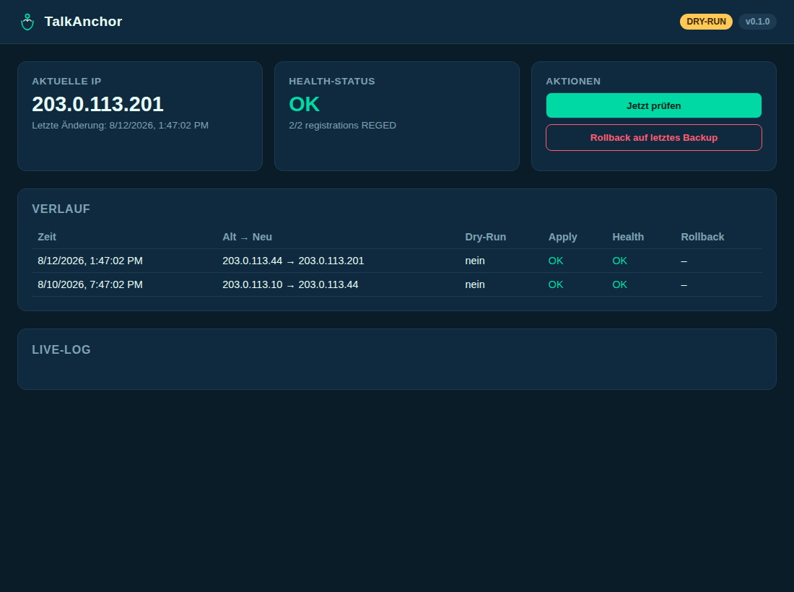

<p align="center">
  <picture>
    <source media="(prefers-color-scheme: dark)" srcset="assets/logo/wordmark-dark.svg">
    
  </picture>
</p>

<p align="center"><em>Deine dynamische IP im Griff. Stay registered. Stay reachable.</em></p>

<p align="center">
  <a href="https://github.com/martin141089/UniFi-Talk/actions/workflows/ci.yml"></a>
  <a href="LICENSE"></a>
  
  <a href="https://github.com/martin141089/UniFi-Talk/pkgs/container/unifi-talk"></a>
</p>

---

**TalkAnchor** hält eine selbst gehostete [UniFi Talk](https://ui.com/talk)-
Installation verankert an deiner aktuellen dynamischen öffentlichen IP —
automatisch, im Hintergrund, ohne dass du dich darum kümmern musst.

**Zwei Wege, TalkAnchor zu betreiben:** als eigenständigen Docker-Dienst
(diese README) oder — wenn du ohnehin schon Home Assistant im Netzwerk
laufen hast — als bequemes [**Home-Assistant-Add-on**](homeassistant-addon/)
mit geführtem Web-Setup, ganz ohne Terminal. Beide nutzen denselben Kern.

### Inhalt

- [Das Problem, das TalkAnchor löst](#das-problem-das-talkanchor-löst)
- [Wie TalkAnchor das löst](#wie-talkanchor-das-löst)
- [Screenshot](#screenshot)
- [Funktionen](#funktionen)
- [Schnellstart](#schnellstart)
- [Haftungsausschluss](#haftungsausschluss)
- [Dokumentation](#dokumentation)

## Das Problem, das TalkAnchor löst

Wenn dein Internetanschluss eine **dynamische IP-Adresse** hat (die meisten
DSL-/Kabelanschlüsse in Deutschland), ändert sich diese IP von Zeit zu Zeit
— bei einer erzwungenen Trennung, nach einem Router-Neustart, oder weil der
Provider es einfach so macht. UniFi Talk merkt sich seine öffentliche IP
aber fest in einer internen Konfigurationsdatei. Ändert sich die IP und
UniFi Talk bekommt es nicht mit, registriert sich dein SIP-Trunk (z. B. bei
der Telekom) nicht mehr richtig — die Folge: **Anrufe brechen ab, das
Telefon klingelt nicht mehr, Gespräche haben keinen Ton mehr.** Gerade für
ein Ferienwohnungs- oder Handwerksbetrieb, bei dem Kunden anrufen können
müssen, ist das kein Detail, sondern ein echtes Geschäftsrisiko.

Ubiquiti bietet dafür keine Lösung an — die IP-Einstellung wird von der
UniFi-Talk-App intern verwaltet und bei jedem App-Update sogar
zurückgesetzt, selbst wenn man sie manuell korrigiert hat. Es gibt nur
vereinzelte Handarbeit-Workarounds in Foren, die nach dem nächsten Update
wieder futsch sind.

## Wie TalkAnchor das löst

TalkAnchor läuft als kleiner, eigenständiger Dienst auf einem separaten
Gerät in deinem Netzwerk (z. B. einem Raspberry Pi, NAS, Mini-PC — oder als
Home-Assistant-Add-on, falls du das ohnehin schon betreibst). Alle paar
Minuten prüft es automatisch:

1. **Wie lautet gerade meine öffentliche IP?** — über zwei unabhängige
   Quellen (Cloudflare-Tunnel-Connector und/oder einen einfachen
   "Wie ist meine IP"-Dienst), die sich gegenseitig plausibilisieren.
2. **Hat sich seit dem letzten Mal etwas geändert?** Wenn nein: nichts
   tun, fertig.
3. **Wenn ja:** vorher ein Backup der UniFi-Talk-Konfiguration anlegen,
   dann die neue IP per SSH sicher eintragen, den SIP-Trunk neu starten
   und prüfen, ob er sich erfolgreich neu registriert.
4. **Falls danach etwas nicht stimmt:** automatisch auf den letzten
   funktionierenden Stand zurückrollen und dich benachrichtigen — nie
   stillschweigend einen kaputten Zustand hinterlassen.

Das Besondere daran: Weil TalkAnchor als eigener Dienst läuft (nicht als
Teil der UniFi-Talk-App), übersteht es auch App-Updates, die die
IP-Einstellung zurücksetzen — im nächsten Prüfzyklus korrigiert es das ganz
von selbst wieder, ohne dass du eingreifen musst. Genau das ist der
eigentliche Mehrwert, nicht nur eine einmalige Reparatur.

## Screenshot



**[Live-Demo →](https://martin141089.github.io/UniFi-Talk/)** (statisch,
Beispieldaten — kein Backend, wird aus `web-demo/` deployed; setzt voraus,
dass GitHub Pages einmalig unter *Settings → Pages → Source: GitHub
Actions* aktiviert wurde) · **[Dokumentation →](https://martin141089.github.io/UniFi-Talk/dokumentation.html)**
(Problem, Funktionsweise, Sicherheitskonzept und Schnellstart im Überblick).

## Funktionen

- **IP-Erkennung aus zwei Quellen** — Cloudflare-Tunnel-Connector-IP als
  primäre Quelle, ein konfigurierbarer HTTP-Echo-Dienst als Fallback; beide
  müssen übereinstimmen, bevor irgendetwas passiert.
- **Dry-Run als Standard** — genau nachvollziehen, was TalkAnchor tun
  *würde*, bevor überhaupt eine SSH-Verbindung aufgebaut wird.
- **Backup vor jedem Schreibzugriff**, lokal und auf dem UDM, mit
  dokumentiertem manuellem Wiederherstellungsweg (siehe
  [SECURITY.md](SECURITY.md)).
- **Health-Check nach jeder Änderung** — fragt `sofia status` nach einer
  scharfen Änderung ab und rollt automatisch zurück (mit klarer
  Benachrichtigung in beiden Fällen), falls die Registrierung nicht wieder
  gesund wird.
- **Rate-Limiting** — ein flatterndes IP-Signal wird protokolliert und
  zurückgestellt, nicht wiederholt scharf ausgeführt.
- **Austauschbare Benachrichtigungen** — ntfy, generischer Webhook (Home
  Assistant, Discord-Relay, Slack) oder E-Mail.
- **Geführter Setup-Wizard, zweimal** — interaktive CLI (`talkanchor
  setup`) für Terminal-Nutzer, und ein gleichwertiger Web-Wizard
  (`/wizard`) für alle anderen (z. B. das Home-Assistant-Add-on über
  Ingress): Cloudflare, Fallback-Quelle, SSH-Einrichtung inkl.
  Host-Key-Abruf und Sofia-Config-Discovery, Benachrichtigungen —
  Schritt für Schritt, inline getestet, am Ende gespeichert.
- **Lokales Dashboard** — aktuelle IP, Änderungshistorie, Live-Log,
  Health-Status, manuelle Prüfen-/Rollback-Buttons sowie ein
  Diagnose-Bereich zum erneuten Prüfen der gespeicherten Konfiguration.
- **Plugin-Architektur** — UniFi Talk ist der Referenz-Zieladapter, nicht
  der einzig mögliche; siehe [CONTRIBUTING.md](CONTRIBUTING.md), um ein
  weiteres SIP-System oder eine weitere IP-Quelle zu ergänzen.

## Schnellstart

> Läuft bei dir bereits Home Assistant? Dann ist der
> [**Home-Assistant-Add-on-Weg**](homeassistant-addon/) meist einfacher —
> Installation über den Add-on-Store, Einrichtung komplett per Web-Wizard,
> kein Terminal nötig. Der Rest dieses Abschnitts beschreibt den
> eigenständigen Docker-/CLI-Weg.

```sh
git clone https://github.com/martin141089/UniFi-Talk.git talkanchor
cd talkanchor
cp .env.example .env   # Cloudflare- + UniFi-SSH-Details eintragen, oder stattdessen den Wizard nutzen
docker compose -f docker/docker-compose.yml up -d
```

Oder zuerst den interaktiven Setup-Wizard ausführen (empfohlen — er kann
den Sofia-Config-Pfad selbstständig per SSH ermitteln):

```sh
uv venv .venv && uv pip install -e . --python .venv/bin/python
.venv/bin/talkanchor setup
```

Der Wizard schreibt zuerst immer `dry_run: true`, bietet an, sofort einen
Testlauf auszuführen, und schaltet erst nach einer zweiten, expliziten
Bestätigung scharf. Siehe [CONFIGURATION.md](CONFIGURATION.md) für jede
Einstellung und [docs/architecture.md](docs/architecture.md) dafür, wie
Reconcile-Loop und Plugin-Adapter zusammenspielen.

Sobald der Dienst läuft, ist das Dashboard unter `http://<host>:8420`
erreichbar.

## Haftungsausschluss

> ⚠️ **Kein offizielles Ubiquiti-Produkt.** TalkAnchor verändert eine von
> der UniFi-Talk-Anwendung verwaltete, nicht offiziell dokumentierte
> Konfigurationsdatei über SSH. Nutzung erfolgt auf eigene Verantwortung.
> Vor dem ersten produktiven Einsatz unbedingt den Dry-Run-Modus nutzen und
> ein aktuelles Backup deines UniFi-Systems vorhalten.

Das vollständige Sicherheitskonzept (SSH nur per Key, Host-Key-Prüfung,
Backups, Health-Checks, Rate-Limiting) steht in [SECURITY.md](SECURITY.md).

## Dokumentation

- [CONFIGURATION.md](CONFIGURATION.md) — jedes Config-Feld, jede Umgebungsvariable, ein vollständiges Beispiel
- [docs/architecture.md](docs/architecture.md) — Reconcile-Loop, Plugin-Protokolle, Deployment
- [SECURITY.md](SECURITY.md) — Sicherheitskonzept, Haftungsausschluss, manuelle Wiederherstellung
- [CONTRIBUTING.md](CONTRIBUTING.md) — neue Source-/Target-/Notify-Adapter beisteuern
- [homeassistant-addon/](homeassistant-addon/) — Home-Assistant-Add-on-Wrapper

## Lizenz

[MIT](LICENSE)
