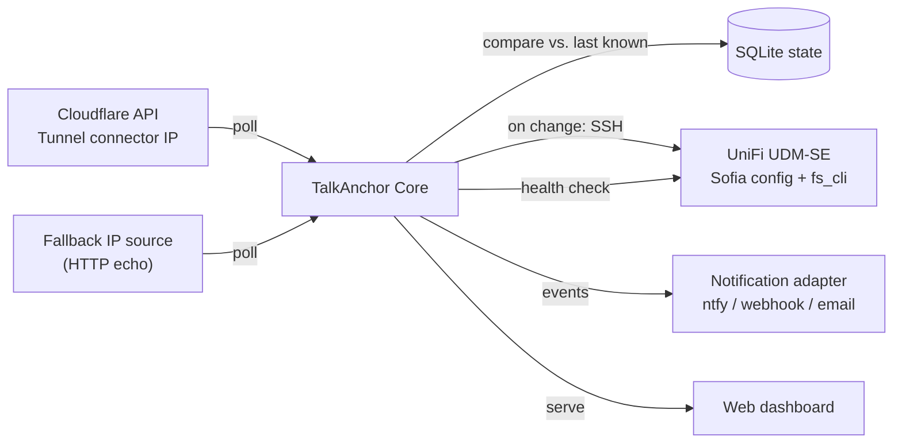
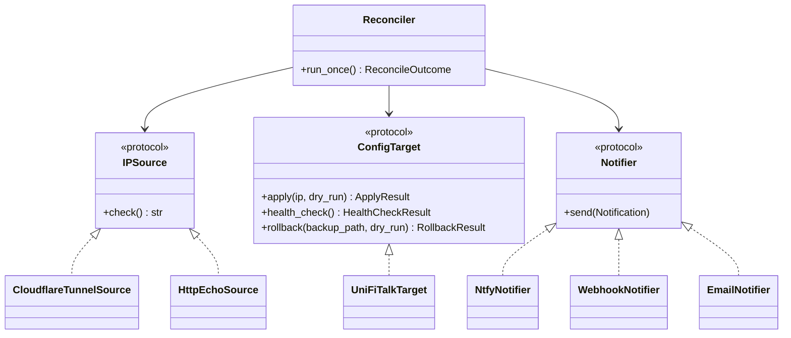

# Architecture

## Overview

TalkAnchor runs as a small, self-hosted service on a host that is **not**
the UDM itself (a Raspberry Pi, NAS, or mini-PC on the same LAN) — running
it on the UDM would mean UniFi Talk app updates could wipe TalkAnchor out
along with the setting it's meant to protect.

## Plugin architecture

TalkAnchor is built around three small protocols
(`talkanchor.sources.base.IPSource`, `talkanchor.targets.base.ConfigTarget`,
`talkanchor.notify.base.Notifier`) so the reconcile loop
(`talkanchor.core.reconciler.Reconciler`) never depends on Cloudflare, SSH,
or any specific notification service directly. UniFi Talk is the reference
target adapter, not the only possible one — see
[CONTRIBUTING.md](../CONTRIBUTING.md) for how to add pfSense, FreePBX, or
another SIP system as a target, or another DNS/STUN provider as a source.

## Reconcile cycle

Every `poll_interval_seconds`, `Reconciler.run_once()`:

1. Asks every configured `IPSource` for the current public IP. If more than
   one source responds, they must all agree — a disagreement (or all
   sources failing) aborts the cycle with a warning notification, nothing
   is applied.
2. Compares the agreed IP against the last known IP (from SQLite). No
   change → nothing happens, not even a log line above `DEBUG`.
3. If changed and not rate-limited (`min_seconds_between_changes`):
   `target.apply(new_ip, dry_run=...)`. In dry-run, this is a pure no-op —
   no SSH connection is opened at all.
   - `apply()` backs up the current config (remote + local copy), patches
     `ext-sip-ip`/`ext-rtp-ip`, and runs `fs_cli -x "reloadxml"` +
     `fs_cli -x "sofia profile <profile> restart"`.
4. On a live (non-dry-run) apply, `target.health_check()` polls
   `sofia status profile <profile> reg` until registrations show `REGED` or
   `health_check_timeout_seconds` elapses.
5. Outcome is recorded to SQLite and sent through the configured
   `Notifier` — success, failure, or a failed-health-check-triggers-rollback
   path all produce a distinct notification.

This whole cycle is exercised in `tests/test_reconciler.py` using in-memory
fakes for all three protocols — no real network or SSH calls are needed to
test the core logic.

## Data model

`talkanchor.core.state.ChangeEvent` (SQLite, via SQLModel) is the only
persisted state: every apply attempt, its outcome, the backup path used,
the health-check result, and whether a rollback happened. The dashboard's
history view and the CLI's `talkanchor rollback` command both read from it.

## Deployment

Docker Compose is the primary deployment path (see the
[README quickstart](../README.md#quickstart)); `talkanchor run` is the
container's entrypoint and starts both the polling scheduler and the
dashboard in one process. A Home Assistant add-on wrapper is also available
(`homeassistant-addon/`) for users who already run HA on their network.
