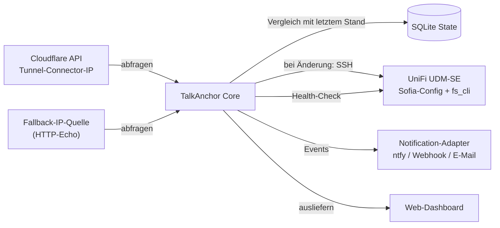
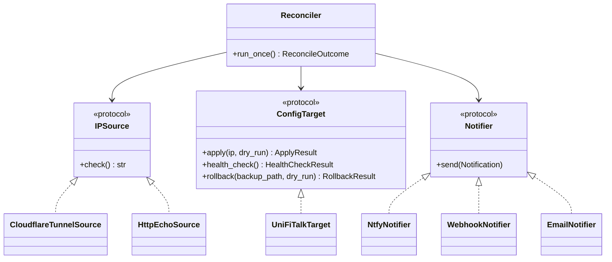

# Architektur

## Überblick

TalkAnchor läuft als schlanker, selbst gehosteter Dienst auf einem Host,
der **nicht** das UDM selbst ist (ein Raspberry Pi, NAS oder Mini-PC im
gleichen LAN) — würde er auf dem UDM laufen, könnten UniFi-Talk-App-Updates
TalkAnchor zusammen mit der Einstellung löschen, die es eigentlich
schützen soll.

## Plugin-Architektur

TalkAnchor ist um drei kleine Protokolle herum aufgebaut
(`talkanchor.sources.base.IPSource`, `talkanchor.targets.base.ConfigTarget`,
`talkanchor.notify.base.Notifier`), sodass der Reconcile-Loop
(`talkanchor.core.reconciler.Reconciler`) nie direkt von Cloudflare, SSH
oder einem bestimmten Benachrichtigungsdienst abhängt. UniFi Talk ist der
Referenz-Zieladapter, nicht der einzig mögliche — siehe
[CONTRIBUTING.md](../CONTRIBUTING.md), wie pfSense, FreePBX oder ein
anderes SIP-System als Ziel bzw. ein weiterer DNS-/STUN-Anbieter als Quelle
ergänzt werden kann.

## Reconcile-Zyklus

Alle `poll_interval_seconds` läuft `Reconciler.run_once()`:

1. Fragt jede konfigurierte `IPSource` nach der aktuellen öffentlichen IP.
   Antworten mehrere Quellen, müssen sie alle übereinstimmen — eine
   Uneinigkeit (oder das Scheitern aller Quellen) bricht den Zyklus mit
   einer Warnbenachrichtigung ab, es wird nichts angewendet.
2. Vergleicht die vereinbarte IP mit der zuletzt bekannten IP (aus
   SQLite). Keine Änderung → nichts passiert, nicht einmal eine Log-Zeile
   oberhalb von `DEBUG`.
3. Bei einer Änderung und ohne Rate-Limit (`min_seconds_between_changes`):
   `target.apply(new_ip, dry_run=...)`. Im Dry-Run ist das ein reines
   No-op — es wird überhaupt keine SSH-Verbindung geöffnet.
   - `apply()` sichert die aktuelle Config (Remote- + lokale Kopie),
     patcht `ext-sip-ip`/`ext-rtp-ip` und führt `fs_cli -x "reloadxml"` +
     `fs_cli -x "sofia profile <profile> restart"` aus.
4. Bei einem scharfen (nicht-Dry-Run-)Apply fragt `target.health_check()`
   `sofia status gateway` ab, bis Registrierungen `REGED`
   zeigen oder `health_check_timeout_seconds` abgelaufen ist.
5. Das Ergebnis wird in SQLite festgehalten und über den konfigurierten
   `Notifier` versendet — Erfolg, Fehler oder ein
   Health-Check-Fehlschlag-mit-Rollback-Pfad erzeugen jeweils eine eigene
   Benachrichtigung.

Dieser gesamte Zyklus wird in `tests/test_reconciler.py` mit
In-Memory-Fakes für alle drei Protokolle durchgespielt — für die
Kern-Logik sind keine echten Netzwerk- oder SSH-Aufrufe nötig.

## Datenmodell

`talkanchor.core.state.ChangeEvent` (SQLite, über SQLModel) ist der
einzige persistierte Zustand: jeder Apply-Versuch, sein Ergebnis, der
verwendete Backup-Pfad, das Health-Check-Ergebnis und ob ein Rollback
stattgefunden hat. Sowohl die Verlaufsansicht des Dashboards als auch der
CLI-Befehl `talkanchor rollback` lesen daraus.

## Deployment

Docker Compose ist der primäre Deployment-Weg (siehe den
[README-Schnellstart](../README.md#schnellstart)); `talkanchor run` ist
der Entrypoint des Containers und startet Polling-Scheduler und Dashboard
gemeinsam in einem Prozess. Für Nutzer, die bereits HA im Netzwerk
betreiben, steht außerdem ein Home-Assistant-Add-on-Wrapper zur Verfügung
(`homeassistant-addon/`).
